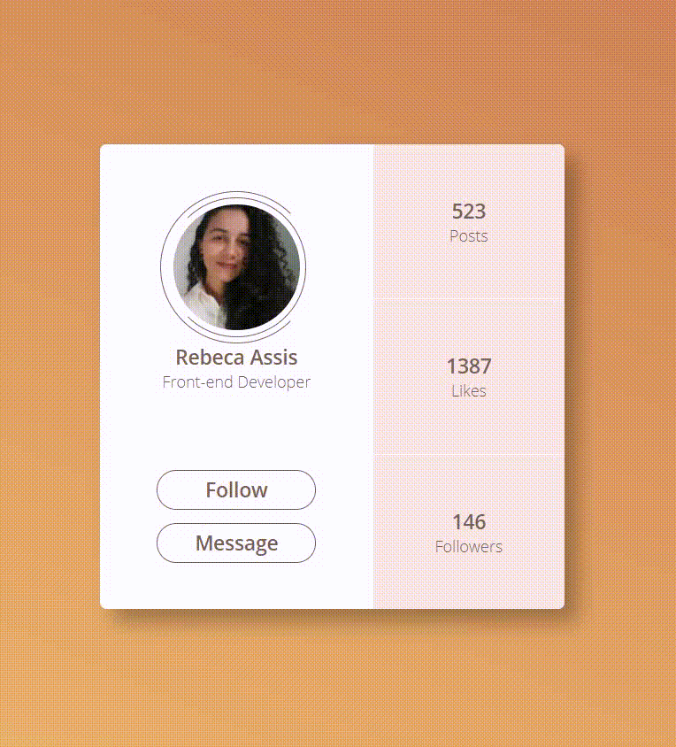

# Desafio de CSS 002: Profile Card

Este é um desafio do [100 Days CSS Challenge](https://100dayscss.com/?dayIndex=5).
O desafio 002 é um Card, que possui informações de um perfil. O card possui eventos que são acionados quando o elemento é sobreposto pelo cursor do mouse.

- Para acionar os eventos utilizei a propriedade ":hover".
- Na imagem do perfil a rotação ocorre, somente nas divs externas, utilizando a propriedade "transform".
- Para alteração de cores nos botões e divs laterais, utilizei a propriedade "transition"
- Para o posicionamento, utilizei FlexBox.

  

Para conferir e testar a aplicação, basta acessar o [link do GitHub Pages](https://rebecaassis.github.io/profile-card/)

## Projetos relacioanados

Aqui você pode conferir o primeiro projeto deste desafio: [Desafio 001](https://github.com/matiassingers/awesome-readme)

  
